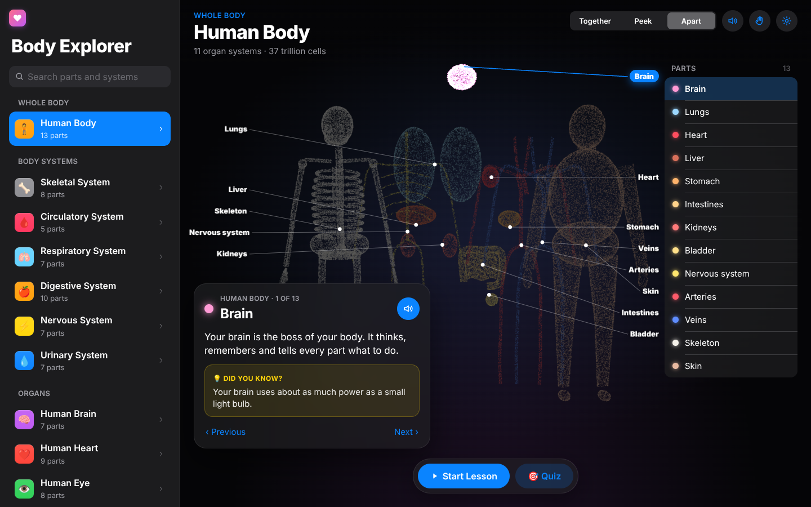

# Vector

**Snap · form · explode — with your hand.**

Vector is a gesture-controlled 3D experience in the browser. Your webcam feeds
MediaPipe Hand Landmarker; custom gesture logic turns the 21 hand landmarks into
actions; a WebGL2 particle engine (no 3D library) simulates and renders 200,000
particles that assemble into anatomy, landmarks, engines, vehicles and machines.


## Body Explorer (for classrooms)

`body.html` is a second app built on the same engine: an iPad-style human-body
explorer for teachers to show children how the body works.



- **13 body systems and organs**: whole body; skeletal, circulatory, respiratory,
  digestive, nervous and urinary systems; brain, heart, eye, ear, tooth and skull.
- **Spoken narration**: tap a part (on the model or in the Parts list) and it is read
  aloud: name, what it does and a fun fact. Uses the browser's built-in speech, so it
  works offline. Voice and speed are in Settings; the speaker button mutes it.
- **Start Lesson**: a guided tour that highlights and narrates every part in turn
  (pause / resume / end).
- **Quiz**: "Can you find the heart?" Five questions per round, with gentle hints for
  wrong answers, a star score and confetti.
- **Together / Peek / Apart** segmented control to take the model apart.
- **Camera mode** ("Start with Camera"): the class sees themselves behind the 3D body
  with their hand skeleton drawn on top. **Pinch a part to pull it out** and it is
  named and explained aloud; point and hold also works. Open hand = apart, fist =
  together, two hands = zoom, peace sign = next part, twist = rotate. A gesture guide
  lights up as each gesture is recognised. (Needs internet the first time to load
  the hand-tracking model; the video never leaves the device.)
- With a mouse or touchscreen you can also drag a part out of the body.
- Works on laptops, interactive whiteboards, iPads and phones (the sidebar collapses).

### Classroom features

| Feature | What it does |
|---|---|
| 🎤 **Ask Body Buddy** | Children ask a question by voice (or typing), e.g. *"Why does my heart beat faster when I run?"*, and hear the answer. Free: a built-in bank of common questions (English + Hindi). With an optional API key, Claude answers any question in 2–4 child-friendly sentences, aware of the part on screen. |
| 🌏 **Languages** | English and **Hindi** are hand-written and work offline (screen, narration, quizzes). Bengali, Tamil, Telugu, Marathi, Gujarati, Kannada, Malayalam and Punjabi are translated free by Chrome’s on-device translator (or by Claude with a key) the first time a system is opened, then cached. Narration uses the device's voice for that language. |
| 🏆 **Quizzes** | One player (pick a student from the class list) or **two teams** taking turns with a live scoreboard. Stars for a correct first try; gentle hints for wrong taps. |
| 📊 **Class Dashboard** | Quizzes played, class average, top scorer, average by body system, most-missed parts, per-student history. **Print report** and **Export CSV**. Everything stays on the device. |
| 📚 **My Lessons** | Teachers pick a system, choose and reorder parts, add notes and **record their own voice** for each step. Saved lessons appear in the sidebar. |
| ♿ **Accessibility** | Large text, colour-blind friendly colours (a CVD-validated palette), reduce motion, and **switch scanning**: parts light up in turn and one key, switch or click chooses. |

### Free by default

Everything works **free and offline without any API key**:

- **Ask Body Buddy** answers from a built-in question bank (`src/body/faq.js`: 30 of
  the questions children ask most, in English and Hindi) and from the lesson for
  any body part the question names.
- **Bengali, Tamil, Telugu, Marathi, Gujarati, Kannada, Malayalam, Punjabi** are
  translated by **Chrome’s built-in on-device Translator** (Chrome 138+ on desktop):
  the language pack downloads once, then everything is saved on the device.

An Anthropic API key is optional: it upgrades Ask Body Buddy to open-ended AI
answers and uses Claude for translation instead.

### Turning on the AI assistant (optional, paid)

1. Get an API key at https://console.anthropic.com/
2. Copy `.env.example` to `.env` and paste the key after `ANTHROPIC_API_KEY=`
3. Restart `npm run dev`

The key stays on the server (`server/assistant.js`, mounted at `/api` by Vite for
both `npm run dev` and `npm run preview`); the browser never sees it. The assistant
uses Claude Opus 5.5 with server-side refusal fallbacks enabled, low effort for
quick spoken answers, and a child-safety system prompt (no diagnosis or medical
advice; off-topic questions are steered back to the body).

Open http://localhost:5173/body.html after `npm run dev`. Narration text lives in
`src/body/content.js` (English) and `src/body/content.hi.js` (Hindi), so teachers
can edit it.

## Quick start

```bash
npm install
npm run dev            # http://localhost:5173
```

Open the page, choose **Start with camera**, and hold your hand up. Video is
processed locally in the browser and never leaves your machine.

URL options:

| Param | Example | Meaning |
| --- | --- | --- |
| `autostart` | `?autostart=nocamera` / `camera` | skip the start screen |
| `model` | `?model=jet-engine` | open a specific model |
| `particles` | `?particles=500000` | particle budget (default 200k) |

## Gestures

| Gesture | Action |
| --- | --- |
| 🫰 Snap (thumb + middle click) | summon particles / dissolve |
| ✊ Fist | assemble the model |
| 🖐️ Open hand slowly | exploded view — openness controls how far |
| 🔄 Twist wrist / raise hand | spin / tilt |
| ☝️ Point | identify the part under your fingertip |
| 🤏 Pinch on a part | grab it and pull it out |
| 🙌 Two hands apart / together | zoom |
| ✌️ Peace (hold) | next model |

No camera? Drag to rotate, scroll to zoom, hover parts, drag parts out, and use
the keyboard: <kbd>Space</kbd> snap, <kbd>F</kbd> assemble, <kbd>E</kbd> explode,
<kbd>N</kbd>/<kbd>←</kbd>/<kbd>→</kbd> models, <kbd>R</kbd> reset, <kbd>A</kbd> auto-rotate,
<kbd>C</kbd> section cut, <kbd>T</kbd> guided tour, <kbd>S</kbd> screenshot, <kbd>H</kbd> help.

## How it works

```
webcam ──► MediaPipe Hand Landmarker (GPU) ──► 21 landmarks / hand
                                                   │  mirrored + mapped to screen px
                                                   ▼
                           gestures.js: finger extension, openness, pinch, roll
                           GestureTracker: debounce, hold (peace), snap timing, 2-hand zoom
                                                   │
                                                   ▼
                           main.js: scene state (form, explode, rotation, zoom, grab)
                                                   │ uniforms
                                                   ▼
   models/*.js ──► sampler.worker.js ──► target positions, explode vectors, colours, part ids
                                                   │ (uploaded once per model)
                                                   ▼
            particles.js: transform-feedback physics (ping-pong buffers) + additive point sprites
```

- **Models** are procedural: each part is a set of primitive surfaces (ellipsoids,
  tapered tubes, splines, surfaces of revolution, gears, …) in `src/shapes.js`.
  They are sampled into particles in a Web Worker, normalised, and every particle
  gets an *explode vector* (part offset + radial spread) so the exploded view is a
  single uniform on the GPU.
- **Physics** runs in a vertex shader with `transformFeedbackVaryings`: each particle
  springs (critically damped) towards `mix(dissolvedCloud, target + explode * amount, form)`,
  with staggered arrival, a curl-like drift when dissolved, hand repulsion, and a
  per-part offset for the part you are pulling out.
- **Picking** projects a subsample of particle targets on the CPU to find the part
  under the fingertip or mouse; labels with leader lines are laid out in two columns
  beside the model.
- **Gestures** use scale-free ratios (fingertip-to-wrist vs knuckle-to-wrist, thumb
  to index knuckle vs palm width, pinch distance vs palm length), with a
  sensitivity setting that shifts all thresholds.

## Models (34)

- **Wonders** — Great Pyramid, Eiffel Tower, Taj Mahal, Colosseum, Stonehenge, Leaning Tower of Pisa, Great Wall, Saturn, Solar System
- **Anatomy** — Human Brain, Human Heart, Kidney, Lungs, Human Eye, Human Ear, Tooth (Molar), Skull, Skeleton, Human Body, Circulatory System, Digestive System, Nervous System
- **Biology** — DNA Double Helix, Animal Cell
- **Engines** — Jet Engine, Inline-4 Engine, Rocket Engine, Electric Motor
- **Vehicles** — Sports Car, Saturn V, Airliner, Bicycle
- **Machines** — Gear Train, Robotic Arm

Add your own in `src/models/` — a model is a `build()` that returns parts made of shapes.

## Tests

```bash
npm run test:unit   # node:test — gestures, tracker timing, every model samples cleanly, every lesson part has narration
npm run test:e2e    # Playwright — both apps with software WebGL2: taps, lessons, quiz, search, synthetic hands
npm test            # both
```

The end-to-end suite needs no camera: `src/synthHand.js` builds realistic 21-point
hands that are injected through `window.__vector.injectHands()`, so open/fist/snap/
point/pinch/peace/two-hand flows are exercised through the real pipeline.

## Project layout

```
index.html            page shell, panels, overlays
src/main.js           app state, camera, input → scene mapping, frame loop
src/particles.js      WebGL2 transform-feedback particle system + shaders
src/hands.js          webcam + MediaPipe Hand Landmarker wrapper
src/gestures.js       pose analysis and temporal gesture tracking
src/synthHand.js      synthetic hand generator (tests / debugging)
src/labels.js         callout labels and leader lines
src/overlay.js        hand skeleton and pose ring overlay
src/shapes.js         procedural surface samplers
src/models/           model catalogue by category
src/sampler.worker.js off-main-thread model sampling
src/viewer.js         camera, projection and picking helpers
body.html             Body Explorer page
src/body/             Body Explorer: app, narration (en/hi), i18n, speech, ask,
                      dashboard, lesson builder, on-device storage, styles
server/assistant.js   AI assistant + translation endpoints (Claude, server-side key)
tests/unit, tests/e2e
```

Requires a browser with WebGL2 (Chrome, Edge, Firefox, Safari 15+).
