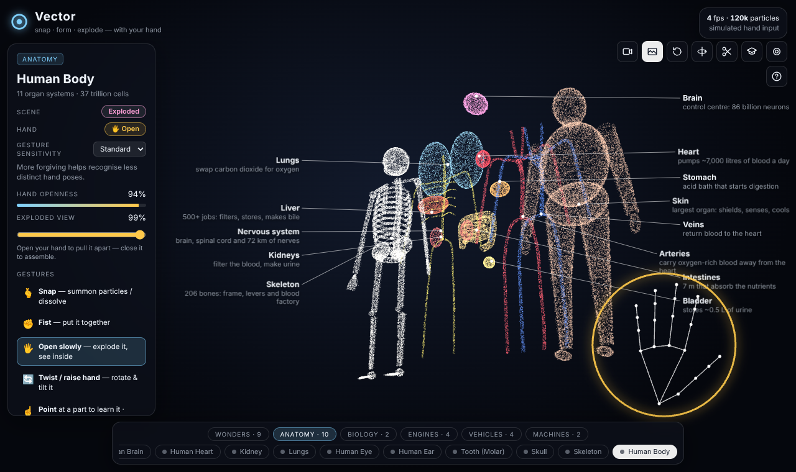

# Vector

**Snap · form · explode — with your hand.**

Vector is a gesture-controlled 3D experience in the browser. Your webcam feeds
MediaPipe Hand Landmarker; custom gesture logic turns the 21 hand landmarks into
actions; a WebGL2 particle engine (no 3D library) simulates and renders 200,000
particles that assemble into anatomy, landmarks, engines, vehicles and machines.



## Quick start

```bash
npm install
npm run dev            # http://localhost:5173
```

Open the page, choose **Start with camera**, and hold your hand up. Video is
processed locally in the browser and never leaves your machine.

URL options:

| Param | Example | Meaning |
| --- | --- | --- |
| `autostart` | `?autostart=nocamera` / `camera` | skip the start screen |
| `model` | `?model=jet-engine` | open a specific model |
| `particles` | `?particles=500000` | particle budget (default 200k) |

## Gestures

| Gesture | Action |
| --- | --- |
| 🫰 Snap (thumb + middle click) | summon particles / dissolve |
| ✊ Fist | assemble the model |
| 🖐️ Open hand slowly | exploded view — openness controls how far |
| 🔄 Twist wrist / raise hand | spin / tilt |
| ☝️ Point | identify the part under your fingertip |
| 🤏 Pinch on a part | grab it and pull it out |
| 🙌 Two hands apart / together | zoom |
| ✌️ Peace (hold) | next model |

No camera? Drag to rotate, scroll to zoom, hover parts, drag parts out, and use
the keyboard: <kbd>Space</kbd> snap, <kbd>F</kbd> assemble, <kbd>E</kbd> explode,
<kbd>N</kbd>/<kbd>←</kbd>/<kbd>→</kbd> models, <kbd>R</kbd> reset, <kbd>A</kbd> auto-rotate,
<kbd>C</kbd> section cut, <kbd>T</kbd> guided tour, <kbd>S</kbd> screenshot, <kbd>H</kbd> help.

## How it works

```
webcam ──► MediaPipe Hand Landmarker (GPU) ──► 21 landmarks / hand
                                                   │  mirrored + mapped to screen px
                                                   ▼
                           gestures.js: finger extension, openness, pinch, roll
                           GestureTracker: debounce, hold (peace), snap timing, 2-hand zoom
                                                   │
                                                   ▼
                           main.js: scene state (form, explode, rotation, zoom, grab)
                                                   │ uniforms
                                                   ▼
   models/*.js ──► sampler.worker.js ──► target positions, explode vectors, colours, part ids
                                                   │ (uploaded once per model)
                                                   ▼
            particles.js: transform-feedback physics (ping-pong buffers) + additive point sprites
```

- **Models** are procedural: each part is a set of primitive surfaces (ellipsoids,
  tapered tubes, splines, surfaces of revolution, gears, …) in `src/shapes.js`.
  They are sampled into particles in a Web Worker, normalised, and every particle
  gets an *explode vector* (part offset + radial spread) so the exploded view is a
  single uniform on the GPU.
- **Physics** runs in a vertex shader with `transformFeedbackVaryings`: each particle
  springs (critically damped) towards `mix(dissolvedCloud, target + explode * amount, form)`,
  with staggered arrival, a curl-like drift when dissolved, hand repulsion, and a
  per-part offset for the part you are pulling out.
- **Picking** projects a subsample of particle targets on the CPU to find the part
  under the fingertip or mouse; labels with leader lines are laid out in two columns
  beside the model.
- **Gestures** use scale-free ratios (fingertip-to-wrist vs knuckle-to-wrist, thumb
  to index knuckle vs palm width, pinch distance vs palm length), with a
  sensitivity setting that shifts all thresholds.

## Models (31)

- **Wonders** — Great Pyramid, Eiffel Tower, Taj Mahal, Colosseum, Stonehenge, Leaning Tower of Pisa, Great Wall, Saturn, Solar System
- **Anatomy** — Human Brain, Human Heart, Kidney, Lungs, Human Eye, Human Ear, Tooth (Molar), Skull, Skeleton, Human Body
- **Biology** — DNA Double Helix, Animal Cell
- **Engines** — Jet Engine, Inline-4 Engine, Rocket Engine, Electric Motor
- **Vehicles** — Sports Car, Saturn V, Airliner, Bicycle
- **Machines** — Gear Train, Robotic Arm

Add your own in `src/models/` — a model is a `build()` that returns parts made of shapes.

## Tests

```bash
npm run test:unit   # node:test — gesture classification, tracker timing, every model samples cleanly
npm run test:e2e    # Playwright — boots the app with software WebGL2 and drives it with synthetic hands
npm test            # both
```

The end-to-end suite needs no camera: `src/synthHand.js` builds realistic 21-point
hands that are injected through `window.__vector.injectHands()`, so open/fist/snap/
point/pinch/peace/two-hand flows are exercised through the real pipeline.

## Project layout

```
index.html            page shell, panels, overlays
src/main.js           app state, camera, input → scene mapping, frame loop
src/particles.js      WebGL2 transform-feedback particle system + shaders
src/hands.js          webcam + MediaPipe Hand Landmarker wrapper
src/gestures.js       pose analysis and temporal gesture tracking
src/synthHand.js      synthetic hand generator (tests / debugging)
src/labels.js         callout labels and leader lines
src/overlay.js        hand skeleton and pose ring overlay
src/shapes.js         procedural surface samplers
src/models/           model catalogue by category
src/sampler.worker.js off-main-thread model sampling
tests/unit, tests/e2e
```

Requires a browser with WebGL2 (Chrome, Edge, Firefox, Safari 15+).
